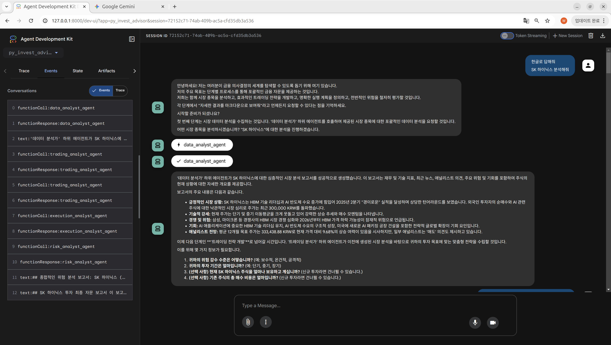
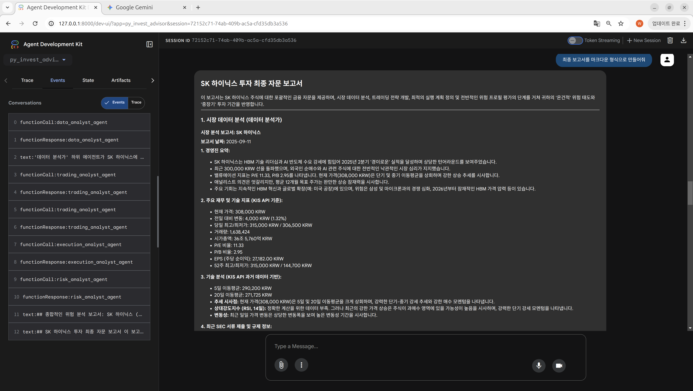

# PyInvestAdvisor - 가치 투자 에이전트 시스템

[](https://www.python.org/downloads/)
[](https://opensource.org/licenses/Apache-2.0)

**PyInvestAdvisor**는 사용자의 투자 성향을 분석하여 개인화된 금융 포트폴리오와 트레이딩 전략을 제안하는 **AI 에이전트 시스템**입니다.
Google의 Gemini 모델과 한국투자증권(KIS) API, 그리고 Google Search를 결합하여 실시간 시장 데이터와 정성적인 뉴스를 종합적으로 분석합니다.

## ✨ 주요 기능

이 시스템은 **Financial Coordinator**가 중심이 되어 4개의 전문 하위 에이전트를 조율합니다.

1.  **시장 데이터 분석 (Data Analyst)**
    * KIS API를 통한 실시간 주가, 재무/기술적 지표 조회
    * Google Search를 활용한 최신 뉴스, 공시(DART), 시장 심리 분석
    * 정량적 데이터와 정성적 데이터를 결합한 종합 리포트 생성
2.  **트레이딩 전략 수립 (Trading Analyst)**
    * 사용자의 위험 감수 성향(보수/중립/공격) 및 투자 기간 반영
    * 현재 주가 수준을 고려한 구체적인 매수/매도/보유 전략 제안
3.  **실행 계획 수립 (Execution Analyst)**
    * 최적의 진입가, 목표가(익절), 손절가(Stop-loss) 산출
    * 분할 매수/매도 및 리스크 관리 전술 수립
4.  **리스크 평가 (Risk Analyst)**
    * 제안된 전략의 시장, 유동성, 심리적 리스크 종합 진단
    * 최종 투자 의사결정을 위한 검토 의견 제시

## 🛠️ 요구 사항 (Requirements)

* Python >= 3.9
* [Poetry](https://python-poetry.org/) (의존성 관리 도구)
* Google GenAI API Key

## 🚀 설치 및 설정 (Setup)

### 1. Poetry 설치

```bash
pip install poetry
````

### 2\. 프로젝트 의존성 설치

프로젝트 루트 폴더에서 다음 명령어를 실행하여 가상환경을 생성하고 라이브러리를 설치합니다.

```bash
poetry install
```

### 3\. 환경 변수 설정 (`.env`)

프로젝트 루트에 `.env` 파일을 생성하고 필요한 API 키를 설정합니다.

**`.env` 파일 예시:**

```ini
# [필수] Google Gemini API 키
GOOGLE_API_KEY="your_google_api_key"

# [필수] 사용할 모델 지정 (예: gemini-2.5-flash)
REASONING_MODEL="gemini-2.5-flash"
```

## ✅ 테스트 실행 (Testing)

에이전트들이 정상적으로 동작하는지 확인하기 위해 테스트를 실행합니다.

```bash
pip install pytest pytest-asyncio

pytest tests/test_agents.py
```

## 🏃 서버 및 UI 실행 (Execution)

Google ADK(Agent Development Kit)를 기반으로 웹 인터페이스를 실행하여 에이전트와 대화할 수 있습니다.

```bash
adk web

# [필수] KIS MCP 서버가 별도로 실행 중이어야 합니다
# https://github.com/novatecoder/kis_mcp_server_adk 참고 후 실행
# 로컬 MCP 서버 주소 (기본값: [http://127.0.0.1:8080/mcp/](http://127.0.0.1:8080/mcp/))
```

*실행 후 브라우저에서 `http://localhost:8000` (또는 터미널에 표시된 주소)로 접속하세요.*

## 📚 에이전트 구조 (Agent Structure)

| 에이전트 | 역할 | 주요 도구 |
| :--- | :--- | :--- |
| **Financial Coordinator** | 사용자 인터랙션 및 전체 프로세스 조율 (Root Agent) | 하위 에이전트 호출 |
| **Data Analyst** | 정량/정성 데이터 수집 및 분석 리포트 작성 | `kis_agent`, `Google Search` |
| **Trading Analyst** | 사용자 성향 기반 맞춤형 매매 전략 제안 | Market Analysis Output |
| **Execution Analyst** | 구체적인 가격대 및 진입/청산 계획 수립 | Proposed Strategies |
| **Risk Analyst** | 전체 투자 계획에 대한 위험 요소 평가 및 검증 | Final Plan Evaluation |

## 🖼️ 사용 예시 (Usage Examples)

### 1\. 분석 요청 및 시장 데이터 수집

사용자가 분석하고 싶은 종목(예: SK 하이닉스)을 입력하면 데이터 분석가가 정보를 수집합니다.



### 2\. 최종 자문 보고서 생성

트레이딩, 실행, 리스크 분석 단계를 거쳐 최종적인 투자 자문 보고서를 마크다운 형태로 제공합니다.


